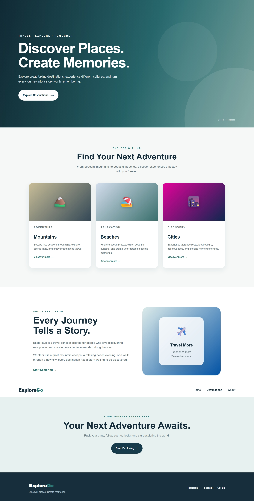
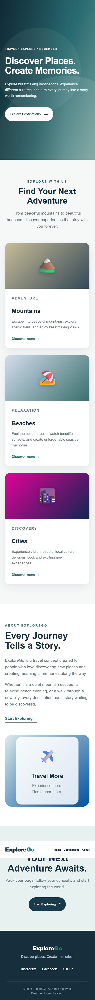

# ExploreGo - Travel Landing Page

## Project Overview

ExploreGo is a responsive travel landing page created as part of the Oasis Infobyte Web Development and Designing Internship.

The website is designed to give visitors a simple and attractive introduction to travel destinations and encourage them to explore new places.

## Features

- Fixed navigation bar
- Hero section with headline and call-to-action button
- Destination section
- About section
- Responsive design for desktop, tablet and mobile screens
- Footer with social media links
- Clean and simple user interface

## Technologies Used

- HTML5
- CSS3
- CSS Flexbox
- CSS Grid
- Responsive Media Queries

## Project Structure

WebDev-L1-LandingPage/
│
├── index.html
├── style.css
├── README.md
└── screenshots

## Screenshots

### Desktop View

### Mobile View

